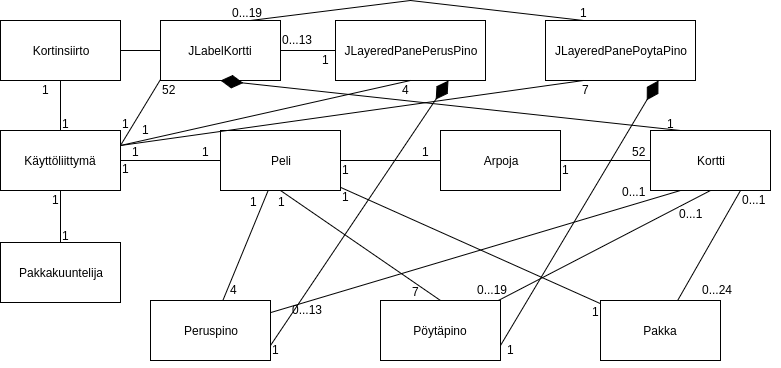
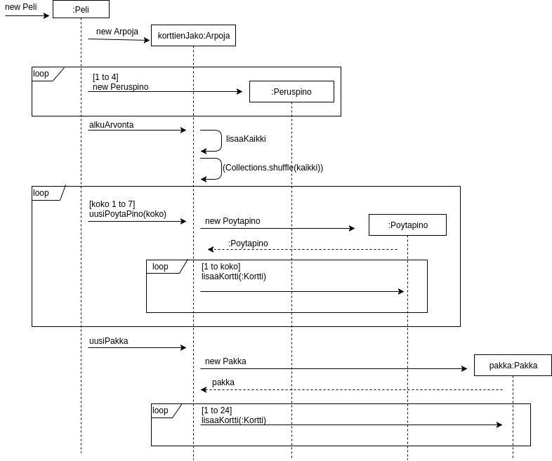
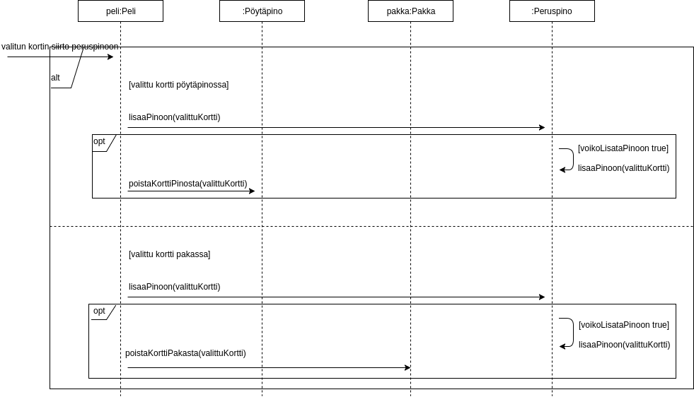

# Aihe: Pasianssi-peli

Toteutetaan yhden pelaajan korttipeli, perinteinen pasianssi. 

**Pelaajan tavoite:** Päästäkseen pelin loppuun on järjestettävä kaikki korttipakan kortit neljään eri pinoon. Kunkin pinon tulee sisältää kaikki saman maan kortit suuruusjärjestyksessä, alimpana ässä ja päällimmäisenä kuningas. 

**Alkuasetelma:** Pelaajan aloittaessa uuden pelin seuraavat ehdot ovat voimassa:
- Pöydällä seitsemän arvottua "työskentelypakkaa", joissa alkaen vasemmalta oikealle 1, 2, 3, 4, 5, 6 ja 7 korttia. Näiden pakkojen päällimmäisimmät kortit ovat oikein päin, loput kortit ylösalaisin.
- "Kädessä" lisäksi pakka, joka sisältää kaikki loput kortit.
- Pöydällä lisäksi erillinen tyhjä tila neljälle eri pinolle, joihin kaikki kortit on tarkoitus järjestää. 

**Pelin eteneminen:** "Työskentelypakassa" ylösalaisin olevan kortin voi katsoa vain, mikäli sen päällä ei ole mitään muuta korttia. Kädessä olevan pakan kortteja voi selata järjestyksessä. Kaikkia kortteja on mahdollista siirrellä. Kortin voi kuitenkin siirtää vain sellaisen kortin päälle, joka on joko
- "työskentelypakassa" arvoltaan yhden suurempi ja eri värinen kortti, tai
- "lopullisessa pakassa" samaa maata edustava, arvoltaan yhden pienempi kortti

Lisäksi kuninkaan voi siirtää tyhjälle "työskentelypakan" paikalle.

**Luokkakaavio**

**Sekvenssikaavio: uuden pelin aloitus**

**Sekvenssikaavio: kortin siirtäminen peruspinoon**

