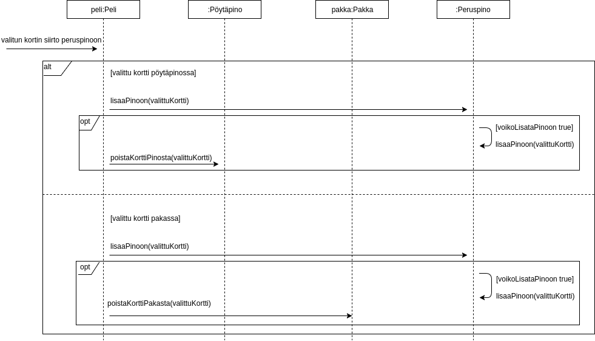

# Aihe: Pasianssi-peli

Toteutetaan yhden pelaajan korttipeli, perinteinen pasianssi. 

**Pelaajan tavoite:** Päästäkseen pelin loppuun on järjestettävä kaikki korttipakan kortit neljään eri pinoon. Kunkin pinon tulee sisältää kaikki saman maan kortit suuruusjärjestyksessä, alimpana ässä ja päällimmäisenä kuningas. 

**Alkuasetelma:** Pelaajan aloittaessa uuden pelin seuraavat ehdot ovat voimassa:
- Pöydällä seitsemän arvottua "työskentelypakkaa", joissa alkaen vasemmalta oikealle 1, 2, 3, 4, 5, 6 ja 7 korttia. Näiden pakkojen päällimmäisimmät kortit ovat oikein päin, loput kortit ylösalaisin.
- "Kädessä" lisäksi pakka, joka sisältää kaikki loput kortit.
- Pöydällä lisäksi erillinen tyhjä tila neljälle eri pinolle, joihin kaikki kortit on tarkoitus järjestää. 

**Pelin eteneminen:** "Työskentelypakassa" ylösalaisin olevan kortin voi katsoa vain, mikäli sen päällä ei ole mitään muuta korttia. Kädessä olevan pakan kortteja voi selata järjestyksessä. Kaikkia kortteja on mahdollista siirrellä. Kortin voi kuitenkin siirtää vain sellaisen kortin päälle, joka on joko
- "työskentelypakassa" arvoltaan yhden suurempi ja eri värinen kortti, tai
- "lopullisessa pakassa" samaa maata edustava, arvoltaan yhden pienempi kortti

Lisäksi kuninkaan voi siirtää tyhjälle "työskentelypakan" paikalle.

**Luokkakaavio**

**Sekvenssikaavio: uuden pelin aloitus**

**Sekvenssikaavio: kortin siirtäminen peruspinoon**

##Ohjelman rakennekuvaus

Käyttöliittymä ja sovelluslogiikka ovat ohjelmassa selkeästi eriytetyt. Main-metodi sijaitsee sovelluslogiikka-paketin luokassa Main. Main-metodi kutsuu luomaansa Käyttöliittymä-luokan ilmentymää luodakseen näkyvän peli-ikkunan. Käyttöliittymä puolestaan luo uuden sovelluslogiikkapuolen Peli-luokan ilmentymän. Pelin konstruktori luo kortit satunnaisilla paikoilla sisältävän alkuasetelman käyttäen apunaan luomaansa Arpoja-luokan ilmentymää. Arpoja luo 52 Kortti-luokan ilmentymää, jotka se jakaa pelin sääntöjen mukaisiin eri tyyppisiin "korttisäilöihin", ja palauttaa nämä pelille. Pakka-luokan, Peruspino-luokan sekä Pöytäpino-luokan ilmentymät sisältävät kukin ArrayListin, johon on talletettu niihin kuuluvat Kortti-luokan ilmentymät. Peruspino-luokan ilmentymien ArrayListit eivät sisällä pelin alkaessa yhtäkään korttia. Pelillä on yksi Pakka-luokan ilmentymä, neljä Peruspino-luokan ilmentymää sekä seitsemän Pöytäpino-luokan ilmentymää. Pelin alkaessa pakka sisältää 24 ja kukin pöytäpino yhdestä seitsemään Kortti-luokan ilmentymää, jokainen seitsemästä pöytäpinosta on eri kokoinen korttien lukumäärältään. "Korttisäilöjä" ja kortteja käsittelevät luokat sisältävät tietoa näiden oliotyyppien ominaisuuksista. Käyttöliittymästä päästään näiden luokkien ilmentymiin käsiksi Peli-luokan kautta.

(Tilanne 27.4.2017: Käyttöliittymäpuolen lopullinen luokkarakenne on vielä työn alla. Jotkut sovelluslogiikkapuolen luokkien metodeista voivat jäädä tai ovat jo mahdollisesti jääneet tarpeettomiksi käyttöliittymän rakenteen ja luokkien metodien tarkentuessa.)

